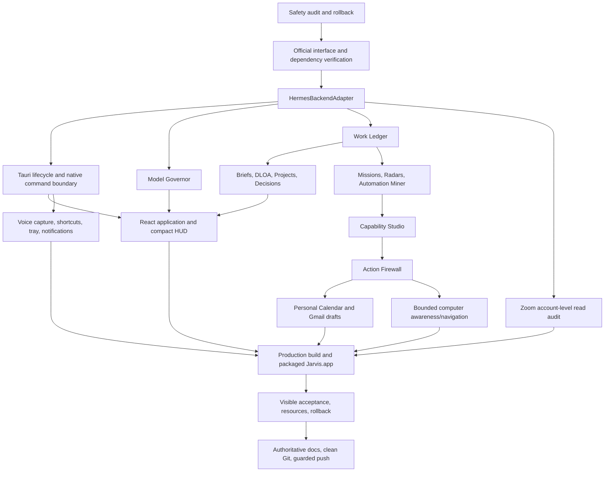

# Prompt 7 Dependency Graph

## Critical invariants across every node

- Hermes remains the intelligence backend; Jarvis is an adapter and product surface, not a second agent.
- Loopback-only authenticated APIs and narrowly enumerated native commands; no arbitrary shell or filesystem bridge.
- One incremental SQLite-backed operational state with immutable evidence provenance; no competing activity databases.
- Context-local time and account/profile separation survive every derived view and action.
- Retrieved data is untrusted evidence and cannot authorize actions.
- External-action kill switches, exact destination locks, budgets, audit, and negative tool inventories remain active.
- No local development server, local frontier LLM, Docker, Postgres, vector service, duplicate gateway, hidden login item, or unrestricted computer mode.

## Parallelizable work after Gate 0

- Official-interface research can run independently for Tauri/macOS, Hermes/Codex, model providers, and Google/Zoom.
- Frontend/static UI can advance against typed fixtures after the adapter contract is frozen.
- Work Ledger/governance and security/action tests can advance independently in separate modules.
- Packaging and visible acceptance depend on all critical runtime seams and cannot be claimed from isolated checks.

